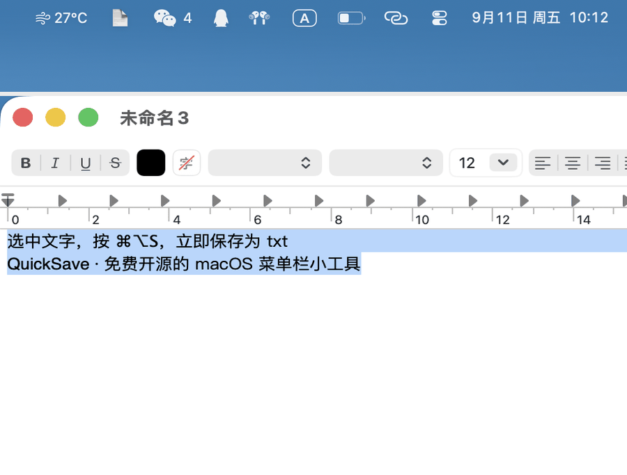

# QuickSave

[](https://github.com/snowbitx/QuickSave/releases)
[](https://github.com/snowbitx/QuickSave/releases)
[](LICENSE)
English | [中文](README.md)

A tiny macOS menu bar app: select text anywhere, press `⌘⌥S`, and it's instantly saved as a `.txt` file in `~/docs` (the folder is created automatically). You can also save your clipboard text as a document with one click.

On success, a HUD banner pops up at the top-right corner with a sound — no notification permission needed. The menu bar icon briefly turns into ✅.



## Install

**Option 1: download a prebuilt copy** (no Xcode needed)

1. Grab `QuickSave.zip` from [Releases](https://github.com/snowbitx/QuickSave/releases), unzip, and move `QuickSave.app` into `/Applications`.
2. First launch: the app is not notarized, so Gatekeeper will block a plain double-click. Right-click → Open in `/Applications`, or run:
   ```bash
   xattr -cr /Applications/QuickSave.app
   ```
3. Grant permission in **System Settings → Privacy & Security → Accessibility** (required to read the text selection).

**Option 2: build from source**

```bash
git clone https://github.com/snowbitx/QuickSave.git
cd QuickSave
make launch
```

Requires Xcode Command Line Tools (`swiftc`).

## Usage

| Menu item | What it does |
|---|---|
| 立即捕捉选中文本 (⌘⌥S) | Capture the current text selection |
| 将剪贴板文本存为文档 | Save clipboard text as a file (leaves the clipboard untouched) |
| 最近保存：… | Last saved file name |
| 打开存储目录 | Open ~/docs in Finder |
| 开机自动启动 | Toggle launch at login |
| 授权辅助功能权限… | Open the Accessibility pane |
| 通知设置… | Open the Notifications pane (optional system banners) |
| 退出 QuickSave | ⌘Q |

## How it works

Two capture strategies, tried in order:

1. **Accessibility API** (`kAXSelectedTextAttribute`) — reads the selection directly from the focused element without touching the clipboard. Works in most native apps (TextEdit, Safari, Notes, …).
2. **Clipboard fallback** — simulates `⌘C`, polls the pasteboard, then restores your previous clipboard content. Covers apps like Chrome and WeChat that don't expose selections (keep the focus inside the text field).

Files are named `yyyy-MM-dd_HHmmss_<first line>.txt`; duplicates get a `_2`/`_3` suffix. The whole app is a single Swift file compiled with `swiftc` — no Xcode project required.

## Configuration

The folder name defaults to `docs`; change it via UserDefaults and relaunch:

```bash
defaults write com.wangxiaoyu.quicksave saveDirName Documents
```

The hotkey is fixed at `⌘⌥S`; edit `hotKeyCode` / `hotKeyModifiers` in `Sources/main.swift` and run `make` to change it.

For debugging, you can trigger a capture without a keyboard:

```bash
notifyutil -p com.wangxiaoyu.quicksave.capture
```

## Project layout

```
QuickSave/
├── Sources/main.swift   # everything: menu bar, capture, save, hotkey
├── Resources/Info.plist # LSUIElement (no Dock icon)
└── Makefile             # plain swiftc build
```

## License

[MIT](LICENSE)
